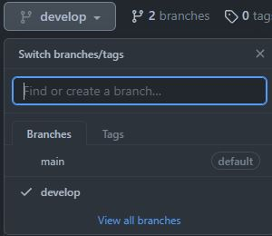
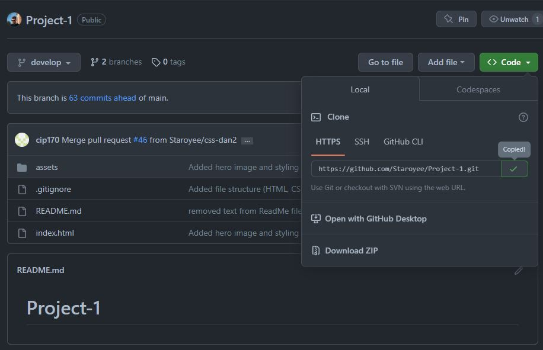
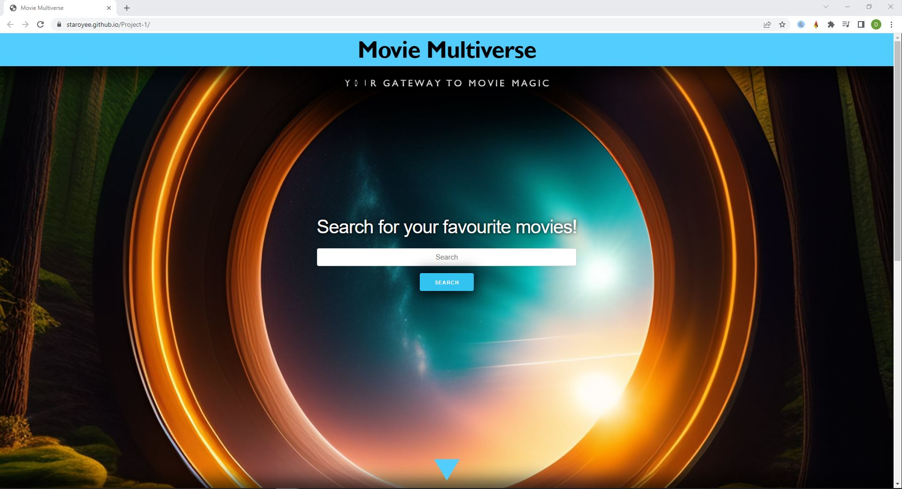
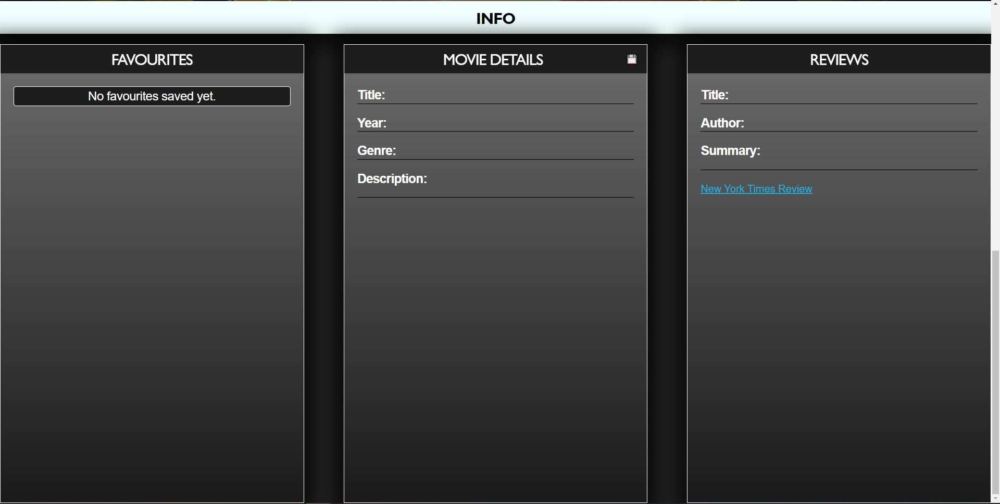

# Project-Movie-Multiverse

## Description
As a team, we were tasked to conceive and execute a design that solves a real-world problem by integrating data received from multiple server-side API requests.

## Solve
The completion of this project provides the user with a functional movie search app, which displays movie details from the TMDB API and a review from the New York Times API.
The movie can be saved in the favourites seciton and be called upon later to re-display the movies details and review.

The webpage is now deployed for use.

## We have learned:
* How to learn to use a new CSS framework
* How to use the CSS framework called 'Skeleton'
* How to find new server-side APIs to use.
* How to read the technical documentation of server-side APIs
* How to use JavaScript to call upon server-side-APIs.
* How to use JavaScript to access the data within the APIs.
* How to use JavaScript to display the data on the webpage.

## Installation
Steps to install this project on your local PC
1. Open the termal on your machine.
2. Use the terminal command `cd` to navigate to the directory where we want the repository located.
3. Navigate to the GitHub repository called 'Project-Movie-Multiverse' and change to the 'develop' branchfor the full project files. 
*  
3. Locate the 'Code' button on the 'develop' branch of the 'Project-Movie-Multiverse' github repository, click it, then copy the 'HTTPS' link to clipboard. (See image)

4. Use the git command `git clone` followed by the URL copied from Github to clone the repo to our machine.
5. The `git clone` command creates a new directory with the same name as the repository. We navigate into our new directory using `cd`.
6. The repository should now be cloned onto your device and able to be edited in VScode or another editing software.

## Instructions

To use the site:
1. Enter the name of a movie into the search bar.
2. Press the search button.
3. View the movie description and review.
4. If an error occurs of 'N/A' is displayed, return to the top of the page to enter another movie name.
5. When the movie details and reviews are successfully loaded, press the save button to save the movie to the favourites section.
6. Click on a movie in the favourites list to re-display the details and review for that movie.
7. Click on the 'x' button next to the corresponding movie to delete that movie from your favourites list.

## Deployed Application Link
* https://staroyee.github.io/Project-Movie-Multiverse/

## Screenshot

## Credits
* https://www.youtube.com/playlist?list=PLVvjrrRCBy2LucxKovfKWrfuFYDhN4cw6
* https://generators.shecodes.io/
* https://www.geeksforgeeks.org/set-the-opacity-only-to-background-color-not-on-the-text-in-css/
* https://lexica.art/prompt/97423571-3bc2-49c1-bd1e-bf24c7729171
* https://coding-boot-camp.github.io/full-stack/github/professional-readme-guide
* https://developer.themoviedb.org/reference/intro/getting-started
* https://developer.nytimes.com/docs/movie-reviews-api/1/types/Review
* https://www.javascripttutorial.net/javascript-fetch-api/
* https://www.geeksforgeeks.org/how-to-use-the-javascript-fetch-api-to-get-data/
